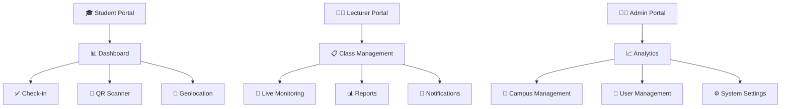
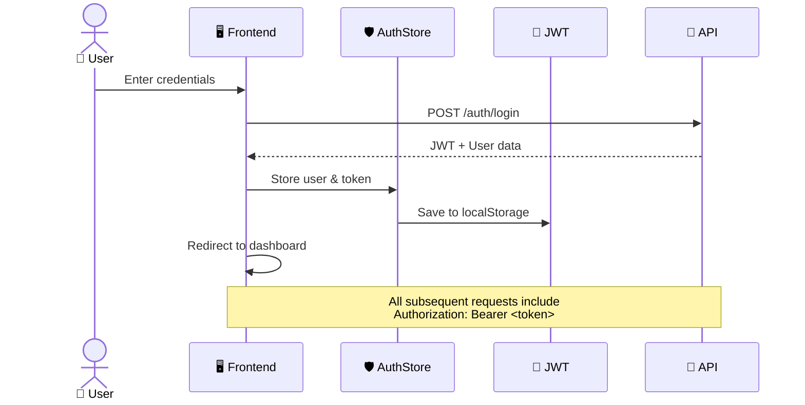
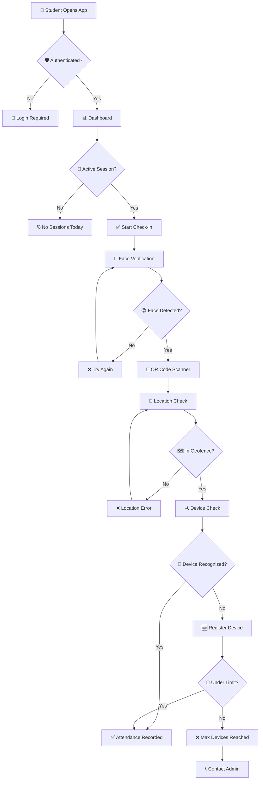

````markdown
<div align="center">

# 🎯 Attendify Frontend

### _The Future of Smart Attendance Management_ ✨

[](https://reactjs.org/)
[](https://typescriptlang.org/)
[](https://vitejs.dev/)
[](https://tailwindcss.com/)

[](https://github.com/LK-Hour/attendify-frontend)
[](https://github.com/LK-Hour/attendify-frontend)
[](https://github.com/LK-Hour/attendify-frontend/issues)
[](https://github.com/LK-Hour/attendify-frontend)

---

## 🌟 **Experience the Next Generation of Attendance Tracking**

_Powered by AI-driven face verification, real-time geofencing, and ultra-secure QR technology_

[🚀 **Live Demo**](https://attendify-demo.vercel.app) • [📚 **Documentation**](https://docs.attendify.com) • [🐛 **Report Bug**](https://github.com/LK-Hour/attendify-frontend/issues) • [💡 **Request Feature**](https://github.com/LK-Hour/attendify-frontend/issues)

</div>

---

## 🎥 **See Attendify in Action**

<div align="center">

### 📱 **Mobile-First Design**

_Responsive experience across all devices_


### 🤖 **AI-Powered Face Verification**

_TensorFlow.js BlazeFace model with 80% confidence threshold_


### 📊 **Real-Time Analytics Dashboard**

_Beautiful charts and insights with Chart.js & Tremor React_


</div>

---

## ⚡ **Why Choose Attendify?**

<table>
<tr>
<td align="center" width="33%">

### 🛡️ **Ultra-Secure**

- **Face Liveness Detection** with TensorFlow.js
- **5-Second QR Expiry** prevents screenshot fraud
- **Device Fingerprinting** (max 3 devices/student)
- **Geofencing Validation** with 50-200m radius

</td>
<td align="center" width="33%">

### ⚡ **Lightning Fast**

- **Vite 7.1** with Rolldown (Rust-powered)
- **React 18** with Concurrent Features
- **Real-time Updates** via WebSocket
- **Optimized Builds** for instant loading

</td>
<td align="center" width="33%">

### 🎨 **Beautiful UX**

- **Dark/Light Mode** with system detection
- **Glass Morphism** design elements
- **Responsive Mobile-First** approach
- **Modern Chart Libraries** (Chart.js + Tremor)

</td>
</tr>
</table>

## 🚀 **Feature Showcase**

<details>
<summary>🎯 <strong>Core Features</strong> - Click to expand</summary>

### 🔐 **Multi-Role Architecture**



### 🛡️ **Security Layers**

| Layer                    | Technology              | Purpose                             |
| ------------------------ | ----------------------- | ----------------------------------- |
| 🤖 **Face Verification** | TensorFlow.js BlazeFace | Liveness detection (80% confidence) |
| 📱 **QR Security**       | Dynamic 5s expiry       | Prevents screenshot fraud           |
| 🔍 **Device Tracking**   | FingerprintJS Pro       | Max 3 devices per student           |
| 📍 **Geofencing**        | Browser Geolocation     | 50-200m radius validation           |
| 🔐 **JWT Auth**          | Secure tokens           | 30-minute session management        |
| 🛡️ **Role Guards**       | React Router            | Route-level authorization           |

</details>

<details>
<summary>🎨 <strong>User Experience</strong> - Click to expand</summary>

### ✨ **Modern UI Components**

- 🌙 **Smart Theme System** - Auto-detects system preference + manual toggle
- 📱 **Mobile-First Design** - Optimized for all screen sizes
- 🎭 **Glass Morphism** - Modern translucent design elements
- 🎨 **Chart.js + Tremor** - Beautiful, interactive data visualizations
- 🔔 **Toast Notifications** - Real-time feedback for all actions
- 🌍 **i18next Integration** - Multi-language support ready

### 🎯 **Interactive Elements**

```typescript
// Example: Smart Theme Hook
const { theme, toggleTheme } = useTheme();
// Auto-detects: 'light' | 'dark' | 'system'

// Example: Real-time Updates
const { attendance, isLive } = useRealtimeAttendance(sessionId);
// WebSocket-powered live data
```

</details>

<details>
<summary>⚡ <strong>Performance Features</strong> - Click to expand</summary>

### 🚀 **Speed Optimizations**

- ⚡ **Vite 7.1** with Rolldown (Rust-powered bundling)
- 🔄 **React 18** Concurrent Features & Suspense
- 📦 **Code Splitting** with lazy loading
- 🗄️ **TanStack Query** for intelligent caching
- 🎯 **Tree Shaking** for minimal bundle size
- 📈 **Web Vitals** optimization

### 📊 **Bundle Analysis**

```bash
# Main bundle: ~150KB (gzipped)
# Chart libraries: ~80KB (lazy loaded)
# TensorFlow.js: ~200KB (on-demand)
# Total initial load: <100KB
```

</details>

## 🛠️ **Tech Stack**

<div align="center">

### **Frontend Powerhouse** 💪

<table>
<tr>
<td align="center">

<br><small>UI Library with Hooks</small>
</td>
<td align="center">

<br><small>Type-Safe Development</small>
</td>
<td align="center">

<br><small>Rust-Powered Bundling</small>
</td>
</tr>
</table>

### **Styling & Design** 🎨

<table>
<tr>
<td align="center">

<br><small>Utility-First CSS</small>
</td>
<td align="center">

<br><small>Beautiful Charts</small>
</td>
<td align="center">

<br><small>Modern Components</small>
</td>
</tr>
</table>

### **AI & Security** 🤖🛡️

<table>
<tr>
<td align="center">

<br><small>Face Detection AI</small>
</td>
<td align="center">

<br><small>Device Tracking</small>
</td>
<td align="center">

<br><small>Secure Authentication</small>
</td>
</tr>
</table>

</div>

<details>
<summary>📦 <strong>Complete Dependency List</strong> - Click to expand</summary>

```json
{
  "dependencies": {
    "🎯 Core": {
      "@tanstack/react-query": "^5.90.5",
      "react": "^18.2.0",
      "react-dom": "^18.2.0",
      "react-router-dom": "^6.20.0"
    },
    "🤖 AI & Detection": {
      "@tensorflow-models/blazeface": "^0.1.0",
      "@tensorflow/tfjs": "^4.22.0",
      "@fingerprintjs/fingerprintjs-pro": "^3.12.3"
    },
    "📊 Data Visualization": {
      "chart.js": "^4.5.1",
      "react-chartjs-2": "^5.3.1",
      "@tremor/react": "^3.18.7",
      "recharts": "^3.3.0"
    },
    "🎨 UI & Styling": {
      "tailwindcss": "^3.4.18",
      "qrcode.react": "^4.2.0",
      "html5-qrcode": "^2.3.8"
    },
    "🛠️ Utilities": {
      "axios": "^1.12.2",
      "zustand": "^5.0.8",
      "zod": "^4.1.12",
      "xlsx": "^0.18.5",
      "date-fns": "^3.6.0"
    }
  }
}
```

</details>

## 📁 Project Structure

```
attendify-frontend/
├── public/                    # Static assets
├── src/
│   ├── assets/               # Images, icons, fonts
│   ├── components/           # React components (Atomic Design)
│   │   ├── atoms/           # Basic building blocks (Button, Input, Badge)
│   │   ├── molecules/       # Component combinations (FormField, Card)
│   │   ├── organisms/       # Complex components (Navbar, Sidebar, AttendanceForm)
│   │   ├── templates/       # Page layouts (DashboardLayout, AuthLayout)
│   │   ├── student/         # Student-specific components
│   │   ├── lecturer/        # Lecturer-specific components
│   │   └── admin/           # Admin-specific components
│   ├── config/              # Configuration files
│   │   ├── env.ts          # Environment variables (QR refresh: 5000ms, Face confidence: 80%)
│   │   └── app.ts          # App constants (auth, attendance, geofence config)
│   ├── contexts/            # React Context providers
│   ├── hooks/               # Custom React hooks
│   ├── lib/                 # Third-party library configs
│   ├── pages/               # Page components
│   │   ├── auth/           # Login, Register, ForgotPassword
│   │   ├── student/        # Student dashboard and features
│   │   ├── lecturer/       # Lecturer dashboard and features
│   │   ├── admin/          # Admin dashboard and features
│   │   ├── shared/         # Shared pages (Profile, Settings)
│   │   └── errors/         # Error pages (404, 403, 500)
│   ├── routes/              # Routing configuration
│   │   ├── index.tsx       # Main router with all routes
│   │   ├── PrivateRoute.tsx # Authentication wrapper
│   │   └── RoleRoute.tsx   # Role-based authorization
│   ├── services/            # External service integrations
│   │   ├── api/            # API client and endpoints
│   │   ├── mock/           # MSW mock handlers
│   │   ├── storage/        # LocalStorage utilities
│   │   └── websocket/      # WebSocket client
│   ├── store/               # Zustand stores
│   │   ├── authStore.ts    # Authentication state (login, logout, user)
│   │   ├── attendanceStore.ts # Attendance state (sessions, records)
│   │   ├── uiStore.ts      # UI state (theme, sidebar, notifications)
│   │   └── index.ts        # Store exports
│   ├── styles/              # Global styles and Tailwind config
│   ├── types/               # TypeScript type definitions
│   │   ├── user.ts         # User, Student, Lecturer, Admin types
│   │   ├── campus.ts       # Campus, Building, Room, Location types
│   │   ├── class.ts        # Class, ClassSchedule types
│   │   ├── attendance.ts   # AttendanceSession, AttendanceRecord, AttendanceRequest
│   │   ├── api.ts          # API response types, RealtimeEvent
│   │   └── index.ts        # Type exports
│   ├── utils/               # Utility functions
│   ├── App.tsx              # Root component with routing and theme
│   ├── main.tsx             # Application entry point
│   └── index.css            # Tailwind directives and custom styles
├── tests/                    # Test files
│   ├── unit/                # Unit tests
│   ├── integration/         # Integration tests
│   └── e2e/                 # End-to-end tests
├── .env.example             # Environment variable template
├── .env.local               # Local environment variables (not committed)
├── tailwind.config.js       # Tailwind CSS configuration
├── postcss.config.js        # PostCSS configuration
├── tsconfig.json            # TypeScript configuration
├── vite.config.ts           # Vite configuration
└── package.json             # Project dependencies
```

## 🚀 **Quick Start Guide**

<div align="center">

### **Get up and running in 60 seconds!** ⏱️

</div>

### **Prerequisites** 📋

```bash
# Check your versions
node --version    # Should be 18+
npm --version     # Should be 9+
git --version     # Any recent version
```

### **Installation** 🔧

<details>
<summary><strong>Option 1: Clone & Run</strong> (Recommended)</summary>

```bash
# 🚀 One-liner setup
git clone https://github.com/LK-Hour/attendify-frontend.git && cd attendify-frontend && npm install && cp .env.example .env.local

# 🔥 Start the dev server
npm run dev
```

**That's it!** 🎉 Visit [http://localhost:5174](http://localhost:5174)

</details>

<details>
<summary><strong>Option 2: Step-by-Step</strong></summary>

```bash
# 1️⃣ Clone the repository
git clone https://github.com/LK-Hour/attendify-frontend.git
cd attendify-frontend

# 2️⃣ Install dependencies
npm install
# or yarn install
# or pnpm install

# 3️⃣ Environment setup
cp .env.example .env.local

# 4️⃣ Configure your environment
nano .env.local  # or code .env.local
```

**Edit `.env.local`:**

```env
# 🌐 API Configuration
VITE_API_BASE_URL=http://localhost:3000/api
VITE_WS_BASE_URL=ws://localhost:3000

# ⚙️ Feature Configuration
VITE_QR_REFRESH_INTERVAL=5000
VITE_FACE_CONFIDENCE_THRESHOLD=0.8
VITE_GEOFENCE_RADIUS=100

# 🔑 API Keys (Optional for development)
VITE_FINGERPRINT_API_KEY=your_fingerprintjs_key
```

```bash
# 5️⃣ Launch! 🚀
npm run dev
```

</details>

### **Development URLs** 🔗

| Service          | URL                                                      | Purpose                   |
| ---------------- | -------------------------------------------------------- | ------------------------- |
| 🎨 **Frontend**  | [http://localhost:5174](http://localhost:5174)           | Main application          |
| 📡 **API Docs**  | [http://localhost:3000/docs](http://localhost:3000/docs) | Backend API documentation |
| 🔍 **Storybook** | [http://localhost:6006](http://localhost:6006)           | Component library         |

### **First Run Checklist** ✅

- [ ] Dependencies installed without errors
- [ ] Environment variables configured
- [ ] Dev server running on port 5174
- [ ] Camera permission granted (for face verification)
- [ ] Location permission granted (for geofencing)
- [ ] Test login with demo credentials

## 📜 **Available Scripts**

<table>
<tr>
<td width="50%">

### **🔧 Development**

```bash
# 🚀 Start dev server (Hot reload + Fast refresh)
npm run dev

# 🔍 Type checking in watch mode
npm run type-check

# 📱 Dev server with network access
npm run dev -- --host
```

</td>
<td width="50%">

### **🏗️ Build & Deploy**

```bash
# 📦 Production build
npm run build

# 👀 Preview production build
npm run preview

# 📊 Bundle analyzer
npm run analyze
```

</td>
</tr>
<tr>
<td>

### **🧹 Code Quality**

```bash
# 🔎 Lint JavaScript/TypeScript
npm run lint

# 🔧 Fix linting issues
npm run lint:fix

# ✨ Format with Prettier
npm run format
```

</td>
<td>

### **🧪 Testing**

```bash
# 🧪 Run all tests
npm run test

# 👀 Watch mode
npm run test:watch

# 📊 Coverage report
npm run test:coverage
```

</td>
</tr>
</table>

### **🚀 Advanced Commands**

<details>
<summary><strong>Performance & Optimization</strong></summary>

```bash
# 📈 Bundle size analysis
npm run build && npm run analyze

# 🎯 Lighthouse CI
npm run lighthouse

# 🔥 Performance profiling
npm run profile

# 🧹 Clean cache
npm run clean
```

</details>

<details>
<summary><strong>Development Tools</strong></summary>

```bash
# 📚 Storybook (Component library)
npm run storybook

# 🔍 Visual regression testing
npm run test:visual

# 🌐 i18n extract translations
npm run i18n:extract

# 🎨 Generate component
npm run generate:component
```

</details>

## 🔐 **Authentication Flow**



<details>
<summary><strong>🔍 Authentication Implementation Details</strong></summary>

```typescript
// authStore.ts - Zustand store
interface AuthState {
  user: User | null;
  token: string | null;
  isAuthenticated: boolean;
  login: (credentials: LoginData) => Promise<void>;
  logout: () => void;
}

// PrivateRoute.tsx - Route protection
export const PrivateRoute = ({ children }: { children: React.ReactNode }) => {
  const { isAuthenticated } = useAuthStore();
  return isAuthenticated ? children : <Navigate to="/login" />;
};

// RoleRoute.tsx - Role-based access
export const RoleRoute = ({
  children,
  allowedRoles
}: {
  children: React.ReactNode;
  allowedRoles: Role[];
}) => {
  const { user } = useAuthStore();
  return allowedRoles.includes(user?.role) ? children : <Navigate to="/403" />;
};
```

</details>

---

## 📱 **Smart Attendance Check-in Flow**

### **🎯 Student Journey**



### **🔒 Security Validation Layers**

<table>
<tr>
<td align="center" width="20%">

### 🤖 **AI Face Detection**

- **BlazeFace Model**
- **80% Confidence**
- **Liveness Detection**
- **Anti-Spoofing**

</td>
<td align="center" width="20%">

### 📱 **QR Security**

- **5-Second Expiry**
- **Dynamic Generation**
- **Screenshot Prevention**
- **Timestamp Validation**

</td>
<td align="center" width="20%">

### 📍 **Geofencing**

- **GPS Validation**
- **50-200m Radius**
- **Room Boundaries**
- **Location Spoofing Protection**

</td>
<td align="center" width="20%">

### 🔍 **Device Tracking**

- **FingerprintJS Pro**
- **Max 3 Devices**
- **Browser Fingerprinting**
- **Device Management**

</td>
<td align="center" width="20%">

### ⏰ **Time Validation**

- **Session Windows**
- **Late Penalties**
- **Grace Periods**
- **Timezone Handling**

</td>
</tr>
</table>

<details>
<summary><strong>⚙️ Backend Security Validations</strong></summary>

```typescript
// Validation pipeline on backend
const validateAttendance = async (checkInData: CheckInRequest) => {
  // 1️⃣ QR Code validation
  if (!isQRCodeValid(checkInData.qrCode)) {
    throw new Error('QR code expired or invalid');
  }

  // 2️⃣ Face verification score
  if (checkInData.faceConfidence < 0.8) {
    throw new Error('Face verification failed');
  }

  // 3️⃣ Geofence validation
  if (!isWithinGeofence(checkInData.location, room.coordinates)) {
    throw new Error('Outside classroom boundary');
  }

  // 4️⃣ Device fingerprint
  if (!isDeviceRecognized(checkInData.fingerprint, student.devices)) {
    if (student.devices.length >= 3) {
      throw new Error('Maximum devices reached');
    }
    await registerNewDevice(student.id, checkInData.fingerprint);
  }

  // 5️⃣ Session timing
  if (!isSessionActive(session)) {
    throw new Error('Attendance session not active');
  }

  return createAttendanceRecord(checkInData);
};
```

</details>

## 🏗️ Architecture Decisions

### Why Zustand over Redux?

- **Simpler API**: No boilerplate, reducers, or actions
- **Better TypeScript**: Native type inference
- **Smaller Bundle**: ~1KB vs 20KB for Redux Toolkit
- **Persist Middleware**: Built-in localStorage sync

### Why Vite over Create React App?

- **10x Faster**: Native ES modules, no bundling in dev
- **Rolldown Experimental**: Rust-powered build tool (even faster than esbuild)
- **Better DX**: Instant HMR, optimized builds

### Why TensorFlow.js over WebRTC?

- **Client-side Processing**: No video streaming to server
- **Privacy**: Face data never leaves device
- **BlazeFace Model**: Lightweight and fast (200ms inference)

### Why MSW over JSON Server?

- **Service Worker**: Intercepts requests at network level
- **No Backend Required**: Develop features without waiting for API
- **Type-safe Mocks**: TypeScript handlers match real API

## 🎯 Key Configuration

### Environment Variables (.env.local)

```env
VITE_QR_REFRESH_INTERVAL=5000        # 5 seconds
VITE_FACE_CONFIDENCE_THRESHOLD=0.8   # 80% confidence
VITE_MAX_CHECK_IN_ATTEMPTS=3         # Anti-spam
VITE_SESSION_TIMEOUT=1800000         # 30 minutes
```

### Geofence Configuration (src/config/app.ts)

```typescript
geofence: {
  enabled: true,
  minRadius: 50,   // 50 meters
  maxRadius: 200,  // 200 meters
  defaultRadius: 100
}
```

### Theme Configuration (tailwind.config.js)

```javascript
theme: {
  colors: {
    primary: { /* Blue shades */ },
    secondary: { /* Gray shades */ },
    accent: { /* Indigo shades */ }
  },
  fontFamily: {
    sans: ['Inter', 'sans-serif'],
    mono: ['JetBrains Mono', 'monospace']
  }
}
```

## 🧪 Testing Strategy

- **Unit Tests**: Components, hooks, utilities (Jest + React Testing Library)
- **Integration Tests**: Store interactions, API calls (MSW)
- **E2E Tests**: Critical user flows (Playwright/Cypress)

## 📚 Documentation

- See `CLAUDE.md` for complete feature specifications
- See `docs/` folder for architecture diagrams (coming soon)
- See inline JSDoc comments for component documentation

## 🛠️ Development Workflow

### Adding a New Feature

1. Create types in `src/types/`
2. Add store slice in `src/store/` if needed
3. Create components in `src/components/` (Atomic Design)
4. Add page in `src/pages/`
5. Update routes in `src/routes/index.tsx`
6. Write tests in `tests/`

### Commit Conventions

```
feat: Add QR code scanning component
fix: Resolve face detection memory leak
docs: Update README with deployment steps
style: Format code with Prettier
refactor: Extract attendance logic to custom hook
test: Add unit tests for authStore
```

## 🚀 **Deployment Guide**

<div align="center">

### **Deploy in seconds to your favorite platform!** ⚡

[](https://vercel.com/new/clone?repository-url=https://github.com/LK-Hour/attendify-frontend)
[](https://app.netlify.com/start/deploy?repository=https://github.com/LK-Hour/attendify-frontend)

</div>

### **🏗️ Build Process**

<details>
<summary><strong>📦 Production Build</strong></summary>

```bash
# 🏗️ Create optimized build
npm run build

# 📊 Analyze bundle size
npm run analyze

# 🧪 Test production build locally
npm run preview
```

**Build Output:**

```
dist/
├── assets/
│   ├── index-[hash].js       # ~150KB (gzipped)
│   ├── index-[hash].css      # ~15KB (gzipped)
│   └── vendor-[hash].js      # ~80KB (gzipped)
├── index.html
└── favicon.ico
```

</details>

### **☁️ Deployment Platforms**

<table>
<tr>
<td align="center" width="25%">

### 🔥 **Vercel**

**Recommended**

[](https://vercel.com/new/clone?repository-url=https://github.com/LK-Hour/attendify-frontend)

✅ Auto deployments  
✅ Edge functions  
✅ Preview URLs  
✅ Analytics

</td>
<td align="center" width="25%">

### 🌐 **Netlify**

**Great for static sites**

[](https://app.netlify.com/start/deploy?repository=https://github.com/LK-Hour/attendify-frontend)

✅ Form handling  
✅ Split testing  
✅ CDN included  
✅ Custom domains

</td>
<td align="center" width="25%">

### ☁️ **AWS S3**

**Enterprise scale**

```bash
aws s3 sync dist/ s3://bucket
```

✅ CloudFront CDN  
✅ Route 53 DNS  
✅ Lambda@Edge  
✅ Enterprise security

</td>
<td align="center" width="25%">

### 🔥 **Firebase**

**Google integration**

```bash
firebase deploy
```

✅ Hosting + Auth  
✅ Real-time DB  
✅ Analytics  
✅ Performance monitoring

</td>
</tr>
</table>

### **🔧 Environment Variables**

<details>
<summary><strong>Production Environment Setup</strong></summary>

**Required Variables:**

```env
# 🌐 API Endpoints
VITE_API_BASE_URL=https://api.yourdomain.com
VITE_WS_BASE_URL=wss://api.yourdomain.com

# 🔑 API Keys
VITE_FINGERPRINT_API_KEY=your_production_key
VITE_GOOGLE_MAPS_API_KEY=your_maps_key

# ⚙️ Feature Flags
VITE_ENABLE_FACE_VERIFICATION=true
VITE_ENABLE_GEOFENCING=true
VITE_DEBUG_MODE=false

# 📊 Analytics
VITE_ANALYTICS_ID=your_analytics_id
VITE_SENTRY_DSN=your_sentry_dsn
```

**Platform-Specific Setup:**

| Platform     | How to Set                                             |
| ------------ | ------------------------------------------------------ |
| **Vercel**   | Dashboard → Project → Settings → Environment Variables |
| **Netlify**  | Dashboard → Site Settings → Environment Variables      |
| **AWS**      | Systems Manager → Parameter Store                      |
| **Firebase** | `firebase functions:config:set`                        |

</details>

## 🤝 **Contributing**

<div align="center">

### **We ❤️ Contributors!**

[](https://github.com/LK-Hour/attendify-frontend/graphs/contributors)
[](http://makeapullrequest.com)
[](https://www.firsttimersonly.com/)

</div>

### **🚀 Quick Contribution Guide**

<details>
<summary><strong>🆕 First Time Contributor?</strong></summary>

1. **🍴 Fork the repo** - Click the fork button at the top right
2. **📥 Clone your fork**
   ```bash
   git clone https://github.com/YOUR_USERNAME/attendify-frontend.git
   cd attendify-frontend
   ```
3. **🌿 Create a feature branch**
   ```bash
   git checkout -b feature/my-amazing-feature
   ```
4. **💻 Make your changes** - Follow our coding standards
5. **✅ Test your changes**
   ```bash
   npm run test
   npm run lint
   ```
6. **📝 Commit with conventional commits**
   ```bash
   git commit -m "feat: add amazing new feature"
   ```
7. **🚀 Push and create PR**
   ```bash
   git push origin feature/my-amazing-feature
   ```

</details>

### **🎯 Contribution Types**

<table>
<tr>
<td align="center">

### 🐛 **Bug Fixes**

Found a bug? We'd love a fix!

[](https://github.com/LK-Hour/attendify-frontend/issues?q=is%3Aissue+is%3Aopen+label%3Abug)

</td>
<td align="center">

### ✨ **New Features**

Have an idea? Let's build it!

[](https://github.com/LK-Hour/attendify-frontend/issues?q=is%3Aissue+is%3Aopen+label%3Aenhancement)

</td>
<td align="center">

### � **Documentation**

Help others understand!

[](https://github.com/LK-Hour/attendify-frontend/issues?q=is%3Aissue+is%3Aopen+label%3Adocumentation)

</td>
<td align="center">

### 🎨 **Design**

Make it beautiful!

[](https://github.com/LK-Hour/attendify-frontend/issues?q=is%3Aissue+is%3Aopen+label%3Adesign)

</td>
</tr>
</table>

### **📋 Commit Convention**

We use [Conventional Commits](https://conventionalcommits.org/) for clear history:

```bash
feat: add face verification component
fix: resolve QR code scanning issue
docs: update installation guide
style: format code with prettier
refactor: extract attendance logic
test: add unit tests for auth store
perf: optimize chart rendering
ci: update deployment workflow
```

---

## 📊 **Project Stats**

<div align="center">


[](https://github.com/LK-Hour/attendify-frontend/graphs/commit-activity)

</div>

---

## 👥 **Meet the Team**

<div align="center">

<table>
<tr>
<td align="center">
<br/>
<sub><b>LK-Hour</b></sub><br/>
<sub>🚀 Lead Developer</sub><br/>
<a href="https://github.com/LK-Hour">GitHub</a> •
<a href="mailto:lk.hour@example.com">Email</a>
</td>
<td align="center">
<br/>
<sub><b>Project Advisor</b></sub><br/>
<sub>🎓 Academic Supervisor</sub><br/>
<a href="#">CADT Faculty</a>
</td>
<td align="center">
<br/>
<sub><b>Contributors</b></sub><br/>
<sub>❤️ Open Source Community</sub><br/>
<a href="https://github.com/LK-Hour/attendify-frontend/graphs/contributors">View All</a>
</td>
</tr>
</table>

### **🏫 Academic Institution**


**Cambodia Academy of Digital Technology (CADT)**  
_Capstone Project 2025_

</div>

---

## 📞 **Support & Community**

<div align="center">

### **Need Help? We're Here!** 💬

[](https://github.com/LK-Hour/attendify-frontend/discussions)
[](https://discord.gg/attendify)
[](https://stackoverflow.com/questions/tagged/attendify)

</div>

### **📋 Getting Help**

| Type                    | Where to Go                                                                                           | Response Time |
| ----------------------- | ----------------------------------------------------------------------------------------------------- | ------------- |
| 🐛 **Bug Reports**      | [GitHub Issues](https://github.com/LK-Hour/attendify-frontend/issues/new?template=bug_report.md)      | 24-48 hours   |
| 💡 **Feature Requests** | [GitHub Issues](https://github.com/LK-Hour/attendify-frontend/issues/new?template=feature_request.md) | 1-2 weeks     |
| ❓ **Questions**        | [GitHub Discussions](https://github.com/LK-Hour/attendify-frontend/discussions)                       | 24 hours      |
| 💬 **Chat**             | [Discord Server](https://discord.gg/attendify)                                                        | Real-time     |

---

## 📄 **License**

<div align="center">

This project is part of an academic capstone project at **Cambodia Academy of Digital Technology (CADT)**.

**Educational Use License** - See [LICENSE](LICENSE) file for details.

---

<br/>

### **Built with ❤️ and ☕ by the CADT Team**


**⭐ Star this repo if you found it helpful!**

</div>
````
